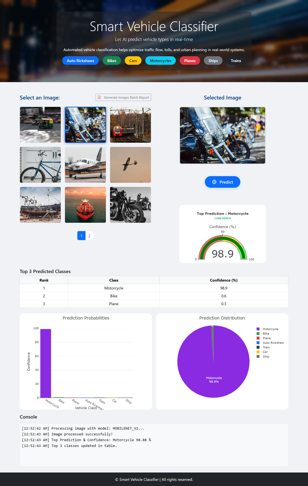
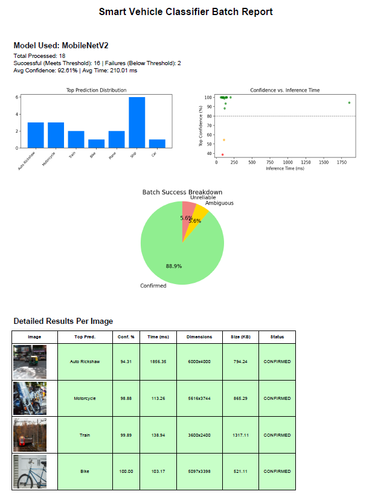
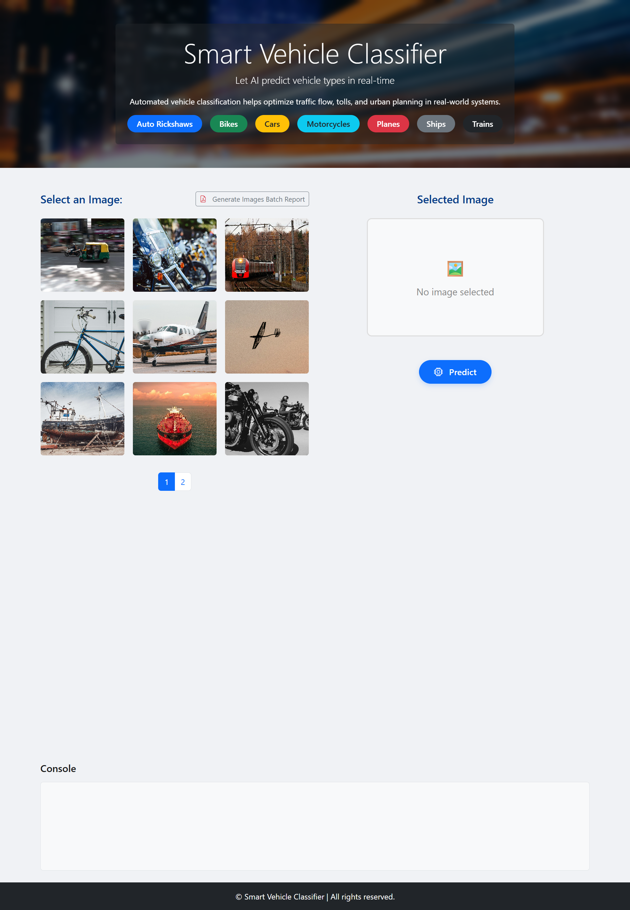

# 🚗 Smart Vehicle Classifier

[](https://flask.palletsprojects.com/)
[](https://www.tensorflow.org/)
[](https://opensource.org/licenses/MIT)

A full-stack AI-powered system that classifies vehicles from images into categories such as Auto Rickshaws, Bikes, Cars, Motorcycles, Planes, Ships, and Trains. Designed for **real-time predictions, interactive visualizations and batch reporting**, making it ideal for showcasing AI and full-stack skills.

---

## ⭐ Key Highlights
- **MobileNetV2 Model:** Deep learning backbone optimized for speed and accuracy.  
- **Re-Trained on Custom Dataset:** Achieves high precision across multiple vehicle types.  
- **Real-time Vehicle Classification:** Automatically predicts vehicle type.  
- **Batch Prediction & Report:** Processes multiple images at once and generates an automated report.  
- **Interactive Visualizations:** Gauge, Pie and Bar charts for analytics and insights.  

---

## 🛠️ Technical Stack
- **Backend / Web Framework:** Python 3.12+, Flask 2.3+ 
- **Machine Learning & Data Processing:** TensorFlow 2.18+ / Keras, NumPy
- **Visualization:** Matplotlib, Plotly 
- **Frontend:** HTML, CSS, Bootstrap

---

## 📦 Core Modules

### 1. Vehicle Classification Module
Processes and predicts vehicle types automatically from predefined images or dataset.  
* **Feature:** Real-time prediction for single or batch images.  
* **UX:** Fully automated classification.  

### 2. Visualization Dashboard
Displays analytics for classified images.  
* **Charts:** Gauge, Pie and Bar charts for classification results.  
* **Report:** Batch image results with summaries.    

---

## 📷 Project Gallery

| Results Visualization  | Prediction Batch Report | Application Landing Page |
| :---: | :---: | :---: |
|  |  |  |

---

## ⚙️ Installation & Setup

1. **Clone & Install:**
   ```bash
   git clone https://github.com/yourusername/Smart-Vehicle-Classifier.git
   cd Smart-Vehicle-Classifier
2. **Install dependencies inside a virtual environment**
    ```bash
    python -m venv venv
3. **Activate this virtual environment**
    ```bash
    source venv/Scripts/activate
4. **Install dependencies**
    ```bash
    pip install -r requirements.txt
5. **Run app** 
    ```bash
    python app.py
6. **Open browser** 
    ```bash
    http://127.0.0.1:5000


